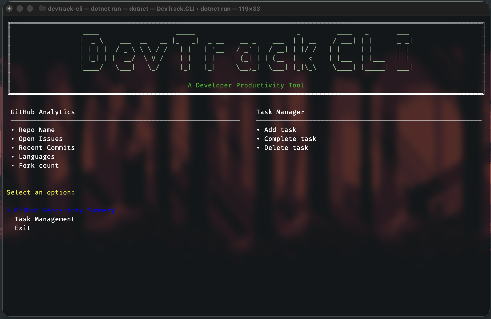
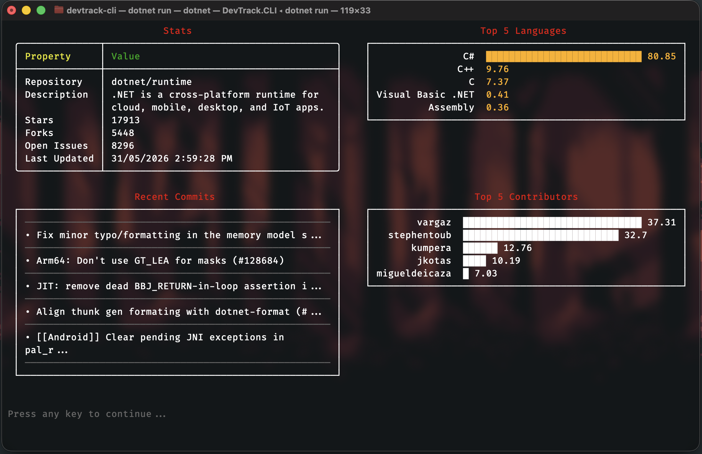
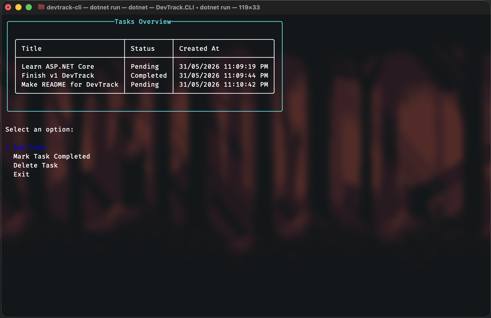
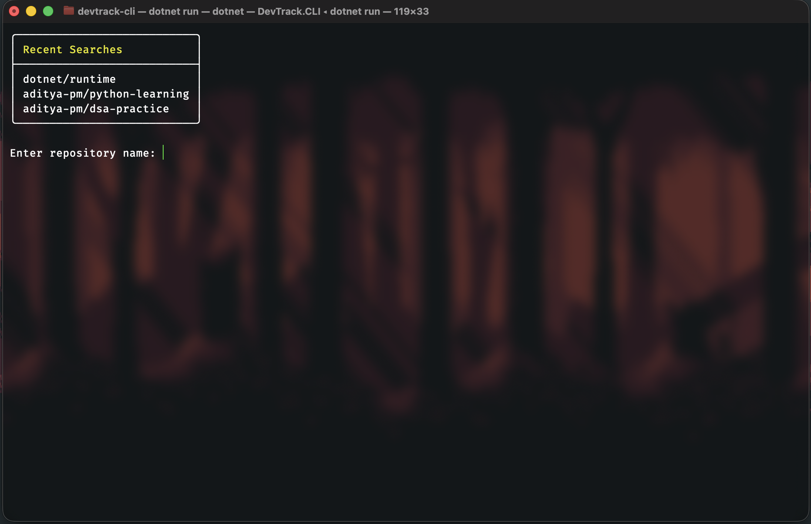

# DevTrack CLI

A developer productivity and GitHub analytics tool built in C# using .NET 10 and Spectre.Console.

DevTrack CLI combines task management with GitHub repository insights in a polished terminal interface. The project was built as a learning exercise to explore modern C# development, asynchronous programming, API integration, application architecture, and terminal user interfaces.

---

## Features

### GitHub Repository Dashboard

Search any public GitHub repository and view:

* Repository statistics

  * Stars
  * Forks
  * Open issues
  * Last updated date
* Top programming languages
* Recent commits
* Top contributors
* Search history

### Task Management

Manage tasks directly from the terminal:

* Create tasks
* Mark tasks as completed
* Delete tasks
* Persistent JSON storage

---

## Screenshots

### Main Menu

The central navigation hub of DevTrack CLI.



---

### GitHub Analytics Dashboard

Repository statistics, language distribution, recent commits, and top contributors.



---

### Task Management

Create, complete, and delete tasks with persistent local storage.



---

### Repository Search History

Previously searched repositories are stored locally for quick access.



---

## Technologies Used

* C#
* .NET 10
* Spectre.Console
* GitHub REST API
* System.Text.Json
* Microsoft.Extensions.Configuration

---

## Project Structure

```text
DevTrackCLI
│
├── Applications
├── Services
├── Views
├── Models
├── Interfaces
├── Data
└── Program.cs
```

### Architecture

The project follows a simple layered architecture:

```text
Program
    ↓
Applications
    ↓
Services
    ↓
Data / External APIs
```

Responsibilities are separated into:

* Applications – feature workflows and orchestration
* Services – business logic and API access
* Views – terminal UI rendering
* Models – application data structures

---

## Configuration

Create an `appsettings.json` file in the project root:

```json
{
  "GitHub": {
    "Token": "YOUR_GITHUB_TOKEN"
  }
}
```

A GitHub Personal Access Token is recommended to avoid API rate limits.

---

## Running the Project

```bash
git clone https://github.com/yourusername/devtrack-cli.git

cd devtrack-cli

dotnet restore

dotnet run
```

---

## Learning Goals

This project was built to explore:

* Object-oriented design
* Asynchronous programming
* REST API consumption
* JSON serialization and deserialization
* Configuration management
* Terminal UI development
* Application architecture and separation of concerns

---

## Future Improvements

Potential future enhancements include:

* Task priorities
* Due dates
* Productivity session tracking
* Report exporting
* Local caching
* SQLite persistence
* Plugin support

---

## License

This project is open source and available under the MIT License.
